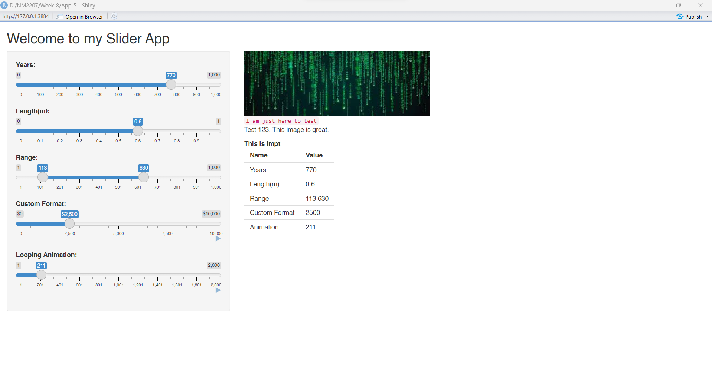

```{r setup, include=FALSE}
knitr::opts_chunk$set(echo = TRUE)
```

## Week 8 Challenge

I have renamed the sliders and title. Inserted a new image to the main panel. Created paragraphs of different styles.

```{r, eval=T,echo=TRUE}
library(shiny)
#runApp("App-5")


```

